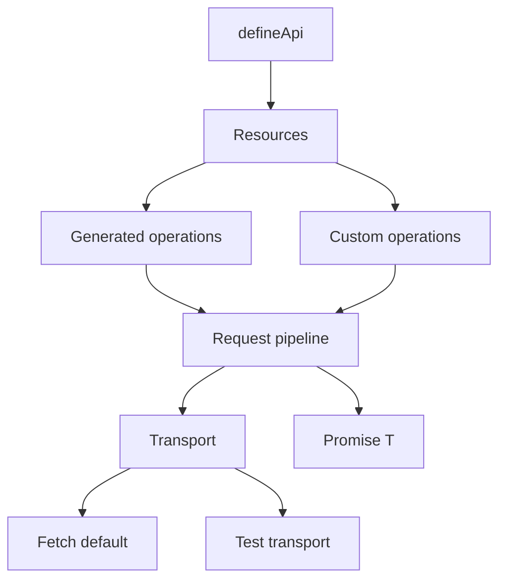

# Architecture

This document describes the architecture Apixa is building toward, and how the current codebase maps to it.

Apixa Core is the only package in scope for v0.1.0. Optional packages (client, server, mocking, TanStack Query, OpenAPI) are planned boundaries, not current work.

## High-level shape

```text
defineApi({ baseURL, headers, resources })
        │
        ▼
   typed API client
        │
        ├── resource (users, posts, …)
        │       ├── generated operations (getAll, getByID, create, …)
        │       └── custom operations (explicit endpoints)
        │
        ▼
   request pipeline
        │
        ├── URL / path / query construction
        ├── headers + body serialization
        ├── Transport.request(...)
        └── parse / errors → Promise<T>
```



## Design rules

1. **Single source of truth** — resources and operations are defined once.
2. **Type inference first** — argument, body, and response types come from definitions.
3. **Conventions with overrides** — generate common methods only when configured; custom endpoints win.
4. **Native promises** — no custom Promise wrappers in Core.
5. **Framework-agnostic** — Core must not depend on React, Next.js, or TanStack Query.
6. **Transport-backed** — HTTP runs through a `Transport` interface; Fetch is the default implementation and stays **inside Core** until a package split is justified.

See also:

- [001-framework-agnostic-core.md](./decisions/001-framework-agnostic-core.md)
- [002-transport-abstraction.md](./decisions/002-transport-abstraction.md)

## Request flow (v0.1.0 target)

1. Caller invokes a resource operation (for example `api.users.getByID("123")`).
2. Core builds path, query, headers, and body from the definition and call arguments.
3. Core calls `transport.request(...)`.
4. On success, Core returns typed data as `Promise<T>` (prefer unwrapping response `data` for query-fn compatibility).
5. On failure, Core throws a standardized `ApiError` subclass (`HttpError`, `NetworkError`, etc.).

## Source map (`packages/core`)

| Responsibility | Intended home | Notes on current scaffold |
| --- | --- | --- |
| API / resource definition (`defineApi`) | `api.ts` | `defineApi` + explicit resource `operations` |
| Endpoint / operation helpers | `endpoint.ts` | Convention defaults, arg parsing, operation callers |
| Request execution pipeline | `client.ts` | URL/headers/body → transport → unwrapped `Promise<T>` |
| Fetch transport | `transport/fetch.ts` | Default transport, kept in Core for v0.1.0 |
| Errors | `errors.ts` | `ApiError` / `HttpError` / `NetworkError` / … |
| Shared types | `types.ts` | Definition + client inference types |
| URL / serialization helpers | `utils.ts` | Path join, interpolation, query, JSON body |
| Public exports | `index.ts` | `defineApi`, types, errors, Fetch / `Transport` |

Out of the v0.1.0 public product surface (may exist in the scaffold today):

- Production `mocks` on API config (do not couple mocking to execution)
- Auth helpers and logging middleware as Core product features
- Schema validation as a Core dependency

## Workspace today vs planned

**Today (v0.1.0 focus):**

```text
packages/core/
examples/basic/
tests/          # vitest, fake Transport
```

**Planned later (do not create yet):**

```text
packages/transport-fetch/
packages/client/
packages/server/
packages/mocking/
packages/tanstack-query/
packages/openapi/
```

Integrations always depend on Core. Core never depends on integrations.

## Related docs

- Living context: [context.md](./context.md)
- Roadmap: [roadmap.md](./roadmap.md)
- Coding contract: [../versions/v0.1.0/](../versions/v0.1.0/)
